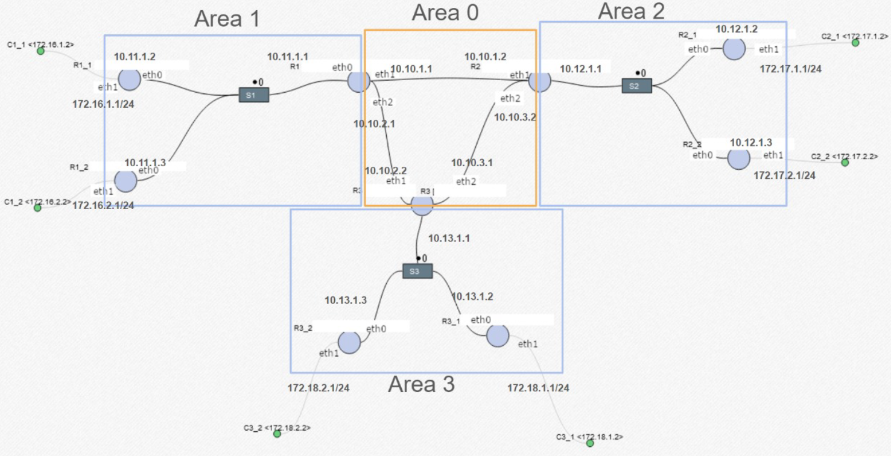

<h1 align="center">
  <br>
    
</h1>

# Inter Domain Routing
Welcome to the Inter Domain Routing Repository. This documentation will guide you through understanding and setting up Inter Domain Routing on your system. You will find all the necessary information and tools in this comprehensive guide.

## Table of Contents
1. [Configuration](#configuration)
2. [Prerequisites](#prerequisites)
3. [Steps](#steps)

# Configuration
<h1 align="center">
  <br>
    
</h1>

# Prerequisites
Before proceeding with the setup, ensure that you have the following prerequisites:

1. **Ubuntu**: If you are using Windows, you can download Ubuntu from:
    [Ubuntu](https://ubuntu.com/desktop/wsl)

2. **Mininet**: Download Mininet from:
    [Mininet](https://mininet.org/)

3. Navigate to the Mininet directory:

    ```bash
    cd mininet
    ```

4. Install all Mininet dependencies by running the following command:

    ```bash
    ./util/install.sh -a
    ```

5. Once the installation is complete, you can proceed with the next steps.

# Steps
Follow the instructions below to get the system up and running:

1. Clone the repository:

    ```bash
    git clone https://github.com/TeamXNetRouter/JKL-InterdomainRouting.git
    ```

2. Navigate to the project directory:

    ```bash
    cd interdomain-routing
    ```

3. Run the scenario one using the following command:

    ```bash
    sudo python3 bgp-topo.py -c frr-config-scenario1
    ```

4. To test the scenario one, you can use the following command in the terminal:

    ```bash
    C1_1 traceroute -n C3_1
    ```

5. Before you run the scenario two, my recommended is you should exit first from scenario one:

    ```bash
    exit
    ```

6. Run the scenario two using the following command:

    ```bash
    sudo python3 bgp-topo.py -c frr-config-scenario2
    ```

7. To test the scenario two, you can use this two following command in the terminal:

    ```bash
    C1_1 traceroute -n C2_1
    ```

     ```bash
    C1_1 traceroute -n C3_1
    ```